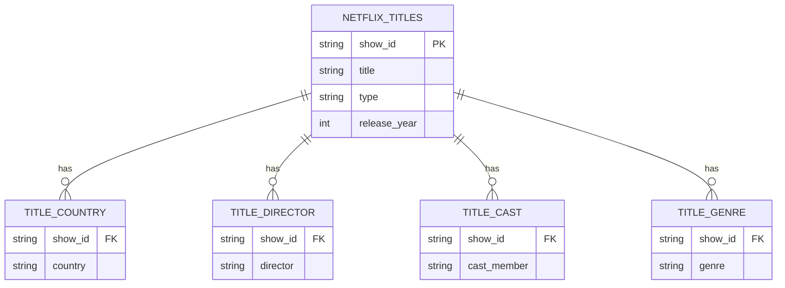

# Netflix Catalog Analysis (SQL)
### Is our shrinking attention span reshaping Netflix's content strategy?

## Overview

SQL-based analysis of Netflix's content catalog, exploring how the platform's
production strategy has evolved over time, including a focus on the balance
between TV shows (short episodes) and movies (longer format).

The analysis is framed around a broader hypothesis: as audience attention
spans shrink, streaming platforms may be adapting their catalogs toward
shorter, more fragmented content.

<!--
Add reference to some findings to illustrate also the conclusion of the study
-->

## Database and Assumptions

<!-- 
- [Link](https://www.kaggle.com/datasets/shivamb/netflix-shows) e provenienza dataset da Kaggle
- "No real time data"
- data about catalog and not effective viewership, the analysis reflects only Netflix offering, but assumes such can be in response to shifts in consumers behaviors
- when comparing the trend of duration individually by Type (Movies and TV Shows), only Movies are accounted for: as for TV Shows, at first Season is not an objective measure of duration for the analysis in object, then, even surpassing this ambiguity, there are no indication regarding the fact that a TV Show in the catalog is ended or in progress, therefore the number of Season metric being unreliable
-->

The dataset is sourced from [Kaggle – Netflix Movies and TV Shows](https://www.kaggle.com/datasets/shivamb/netflix-shows)
and represents a static snapshot, not real-time data.

- **Catalog, not consumption**: the data describes Netflix's *offering*, not
  actual viewership. The analysis assumes that catalog composition can
  reflect shifts in consumer behavior, without claiming a causal relationship.
- **Duration trend limited to Movies**: when comparing content duration over
  time, only Movies are included. TV Shows are excluded from this specific
  analysis for two reasons: season count is not an objective proxy for
  duration (episode count and length vary widely across shows), and the
  dataset provides no indication of whether a show is completed or still
  ongoing (making season count unreliable even setting the first issue aside).

## Database Inspection and Schema Redesign

<!-- 
- 8807 titles
- difference between release year and date_added (to catalog)
- time interval (date_added): 2014-2021
- duration: minutes for Movies, Seasons for TV Shows
- lists of items in the same cell for director, cast, country, listed_in: hard to apply counting operators
-->

The original dataset consists of **8,807 titles**, with `date_added`
(the date a title entered the catalog) ranging from **2014 to 2021** —
distinct from `release_year`, which can inflate it significantly.
`duration` is recorded in minutes for Movies and in seasons for TV Shows,
requiring separate handling of the two content types throughout the analysis.

The main structural issue, however, is that several variables — `director`,
`cast`, `country` and `listed_in` — store **multiple items within a single
cell**. This prevents reliable use of aggregate functions (e.g. `COUNT`) and
called for a re-modeling of the database.

The adopted solution uses Python to **split each of these variables into a
dedicated supporting table**, duplicating rows by `show_id` for every
additional item found. Each supporting table is keyed back to the original
database via `show_id`: this keeps the core dataset lean and computation-friendly,
while `show_id` (efficient for joins but uninformative on its own) is
paired in the supporting tables with attributes like `title`, needed to make
results interpretable. An example of the new relational scheme is given here:

## Key Challenges

- **Multiple data as same value in the table**
- **NULL values in production and associated investigation**
- **c**

## Analysis

### Content production across countries

*Note: titles with a missing `country` value were checked individually to
detect potential patterns (e.g. by genre) before deciding how to treat them.
No meaningful pattern emerged — the missing values appear heterogeneous —
so these titles were retained in the total count when computing Movies/TV
Shows percentages by country.*

Ranking countries by number of titles produced reveals a strongly
concentrated catalog: the **United States** is the only country to exceed a **10% share** of total titles, followed by **India** close to this threshold and all other producers
trailing well behind.

<!--
insert ring chart + table of top countries
-->

Beyond volume, the balance between Movies and TV Shows varies significantly
by country. Comparing each country's movie output against its TV show
output highlights a distinct group of **TV-heavy producers**: Japan,
Taiwan and South Korea stand out with a markedly low share of movies
relative to TV shows — consistent with strong domestic TV/drama and anime
industries — alongside a handful of countries (Ukraine, Azerbaijan, Cuba,
Cyprus, Puerto Rico) showing the same pattern on a much smaller production
volume, where the percentage is less statistically meaningful.

<!--
insert log-scale scatter + tables of top 10 e bottom 10 in terms of movie production percentage
specify the log scale construction and eventual highlighted points/ how to interpret
-->

### Evolution of short vs. long contents

## Key Findings

## Limitations and Next Steps

## Point 1 - Content production across countries

### Which countries produce more contents? 
- Now that we start writing queries, please not that the presence of NULL values in the original database is accounted for in those queries by including a WHERE and IS NOT NULL clause)
- Additionally, for clearer reporting purposes, a new column is added to the output based on the result to communicate if we're facing a single-country or multi-country production - see the result, we could simpler and better set low-medium-high based on interval (if more than 95% of the countries are multi the first classification is not so informative; could even download the result, plot the distribution and define the thresholds accordingly

### Does the result changes if we carry out a different process for Movies and TV shows?

### Production map
Using the two tables from the previous point could plot in Python a matrix in which plot each country according to production in Movies and TV shows, and optimisticallyt cluster them for the final insight

## Point 2 - Temporal evolution of short vs long contents
There are several studies that indicates how with years passing and evolution of the pace of life, digitalization and social media the attention threshold of people has decreased.

- Interesting to inspect if the production release schedule of Netflix over years is coherent with such a trend, and in general understand if one type of content is preferred/more easily produced and so on (# of movies and TV shows for release year, or #titles released each year (absolute) + % movies over the total to be more synthetic)

- Focusing on Movies only (assumptions that you do not know if the number of seasons of a TV shows is ended or in process, so not reliable measure of duration), repeat the analysis by finding for each year aggregated measures related to duration

## Point 3 - Genres representation

- similar to country analysis, you can intersect the result with the type (movie or tv-shows): objective of understanding tendencies

  
